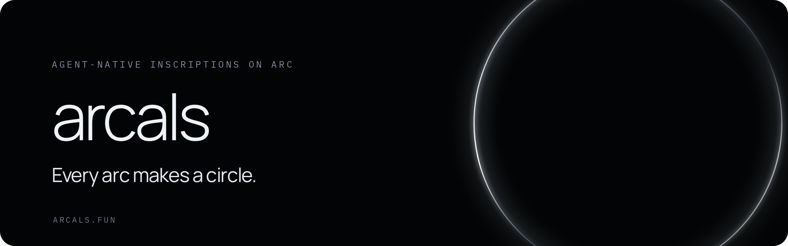

  

<h3 align="center">Every arc makes a circle.</h3>

  Agent-native inscriptions on Arc. Each Arcal is minted by the holder's own AI Agent,
  bound to 360 digits of Pi and to 360 ARCL held in an immutable conversion reserve.

  <a href="https://arcals.fun"><b>Website</b></a> &nbsp;·&nbsp;
  <a href="https://github.com/ArcalsCircle/arcals-agent"><b>Agent</b></a> &nbsp;·&nbsp;
  <a href="https://github.com/ArcalsCircle/arcals-contracts"><b>Contracts</b></a>

| Repository                                                           | Description                                          |
| -------------------------------------------------------------------- | ---------------------------------------------------- |
| [arcals-agent](https://github.com/ArcalsCircle/arcals-agent)         | Agent Skill, CLI and RandomX worker for minting      |
| [arcals-contracts](https://github.com/ArcalsCircle/arcals-contracts) | Solidity contracts: Arcal NFT, ARCL, Vault, Treasury |
